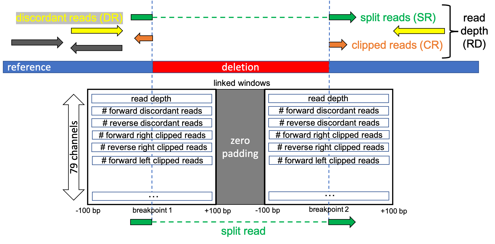

# sv-channels

[](https://doi.org/10.5281/zenodo.4584797)
[](https://travis-ci.org/GooglingTheCancerGenome/sv-channels)

*sv-channels* is a Deep Learning workflow for calling structural variants (SVs) in short read alignment data using one-dimensional Convolutional Neural Networks (CNN). It has been tested on a benchmark dataset with [three cell lines](https://doi.org/10.5281/zenodo.4001614): two samples (NA12878 and NA24385) from the [Genome in a Bottle](https://www.nist.gov/programs-projects/genome-bottle) consortium and one [synthetic diploid](https://doi.org/10.1038/s41592-018-0054-7) sample (CHM1_CHM13).

*sv-channels* supports five SV types:
- deletions (DEL)
- insertions (INS)
- inversions (INV)
- tandem duplications (DUP)
- inter-chromosomal translocations (CTX)

The [workflow](doc/sv-channels.svg) includes the following key steps:

**Transform read alignments into channels**

First, split read positions are extracted from the BAM files as candidate regions for SV breakpoints. For each pair of split read positions (rightmost position of the first split part and leftmost position of the second split part) a 2D Numpy array called *window* is constructed. The shape of a window is [*window_size*, *number_of_channels*], where the genomic interval encompassing the window is centered on the split read position with a context of \[-100 bp, +100 bp\) for a *window_size* of 200 bp. From all the reads overlapping this genomic interval and from the relative segment subsequence of the reference sequence 79 (*number_of_channels*) channels are constructed, where each channel encode a signal that can be used for SV calling. The list of channels can be found [here](doc/channels_list.tsv). The two windows are joined as *linked-windows* with a zero padding 2D array of shape [10, *number_of_channels*] in between to avoid artifacts related to the CNN kernel in the part at the interface between the two windows. The linked-windows are labelled as *SV* when the split read positions overlap the SV callset used as the ground truth and *noSV* otherwise, where *SV* is either DEL,INS,INV,DUP or CTX according to the SV type.



**Model training**

The labelled *linked-windows* are used to train a 1D CNN to learn to classify them as either SV or noSV. Two cross-validation strategies are possible: 10-fold cross-validation and cross-validation by chromosome, where one chromosome is used as the test set and the other chromosomes as the training set.

**SV calling with a trained model**

Once a trained model is generated and the BAM file for the test set is converted into *linked-windows*, the SV calling is performed using the [`predict.py`](/scripts/genome_wide/predict.py) script.

## Dependencies

-   [Conda](https://conda.io/)
-   listed in [`environment.yaml`](/environment.yaml)

**1. Clone this repo.**

```bash
git clone https://github.com/GooglingTheCancerGenome/sv-channels.git
cd sv-channels
```

**2. Install dependencies.**

```bash
# download Miniconda3 installer
wget https://repo.continuum.io/miniconda/Miniconda3-latest-Linux-x86_64.sh -O miniconda.sh
# install Conda (respond by 'yes')
bash miniconda.sh
# update Conda
conda update -y conda
# create & activate new env with installed deps
conda env create -n sv-channels -f environment.yaml
conda activate sv-channels
```

**3. Execution.**

-   **input**:
    - read alignment in [BAM](https://samtools.github.io/hts-specs/SAMv1.pdf) format
    - reference genome used to map the reads in [FASTA](https://www.ncbi.nlm.nih.gov/BLAST/fasta.shtml) format
-   **output**:
    - SV callset in [VCF](https://samtools.github.io/hts-specs/VCFv4.3.pdf) format

```bash
SCH=local  # gridengine or slurm
BAM=data/test.bam
SEQIDS="12,22"
SVTYPES="INV,DEL,INS,INV,DUP,CTX"
./run.sh $SCH $BAM $SEQIDS $SVTYPES # run jobs locally or on a compute cluster
```

## Contributing

If you want to contribute to the development of _sv-channels_,
have a look at the [CONTRIBUTING.md](CONTRIBUTING.md).

## License

Copyright (c) 2020, Netherlands eScience Center

Licensed under the Apache License, Version 2.0 (the "License");
you may not use this file except in compliance with the License.
You may obtain a copy of the License at

http://www.apache.org/licenses/LICENSE-2.0

Unless required by applicable law or agreed to in writing, software
distributed under the License is distributed on an "AS IS" BASIS,
WITHOUT WARRANTIES OR CONDITIONS OF ANY KIND, either express or implied.
See the License for the specific language governing permissions and
limitations under the License.
